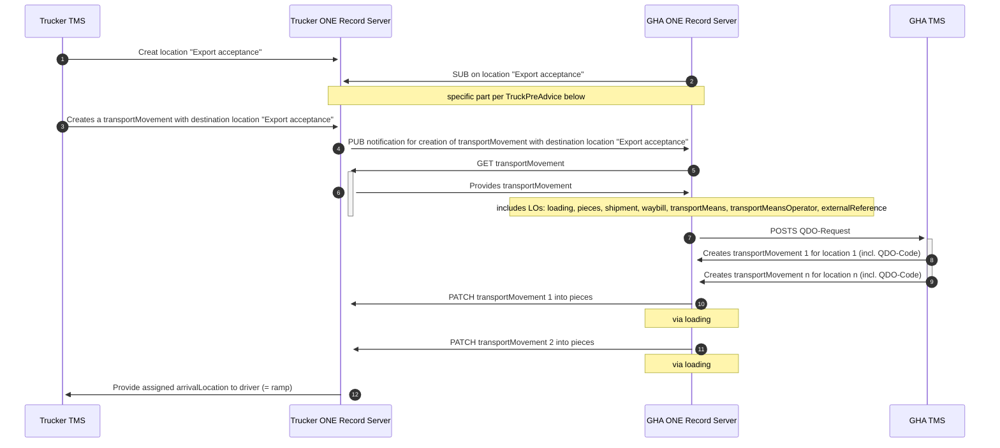

# Good Practice: TruckPreAdvice
[](https://digital-cargo.org)
[](https://creativecommons.org/licenses/by/4.0/)

## Abstract

Today, there´s a lack of transparency for the information on road trucks in the context of cargo transportation. This is often the result of strongly distributed responsibilities and tasks between trucking company, forwarder and air cargo carrier.

The ONE Record standard is supposed to solve this problem by providing a standard tp share any kind of data between any stakeholder. This good practice document describes the methodology for providing and consuming TruckPreAdvice Information via ONE Record, making this data effortlessly accessible to others. Based on the ONE Record API version 2.0.0 and the ONE Record Data Model version 3.0.0, this document provides guidance on how to implement this data in an easy-to-use and standardized manner.

## Introduction

In the dynamic world of logistics and cargo, shipment tracking stands as a cornerstone, ensuring visibility, predictability, and trust within the supply chain. 
Yet, as businesses expand and systems diversify, the industry faces a challenge: the myriad of non-standardized tracking systems, each requiring unique integration and understanding. This fragmentation not only complicates operations but also escalates costs and reduces efficiency.

Initiated and moderated by the International Air Transportation Association (IATA), in 2022, major stakeholders of the supply chain decided to aim for a renewed data sharing infrastructure for the global logistics networks by 2026.
Enter the ONE Record standard, which aims to unify, streamline and improve shipping data across the industry. 
By leveraging the ONE Record standard, stakeholders can draw on a unified data model and API that promotes seamless integration across various platforms and improves collaboration between various organizations. 
This standardization comes with a number of benefits, from reducing the complexity and cost of custom integrations to enhancing transparency and trust.
It lays the foundation for standardization, enabling a consistent data model and API across diverse platforms, thereby streamlining integrations and collaborations.
This uniformity heightens transparency, allowing stakeholders to effortlessly interpret shipment data, fostering trust throughout the supply chain.
Moreover, the standardized approach curtails complexities tied to integration, conserving both time and resources that might otherwise be diverted to bespoke solutions. 


### Scope

This good practice details the application of the ONE Record standard specifically in the context of TruckPreAdvice. 

**What this document covers:**

- **Business context**: Assumptions, prerequisites, and the broader business scenario where this good practice is applicable.
- **Technical examples**: Detailed descriptions and examples of the API calls, data model classes, data mappings, and their applications in the context of shipment tracking.

**What this document does not cover:**

- **Compelete implementations**: This good practice includes sample code to support knowledge transfer, it does not provide detailed implementation or out-of-the-box software.
- **Comparison with other standards**: This good practice describes the implementation with the ONE Record Standard. A comparison with other standards in the industry is not covered.
- **Vendor-specific implementations**: This document focuses on the standard itself and does not address specific third-party tools or solutions based on the ONE Record standard.
- **Complete technical specifications**: This document focuses solely on the ONE Record aspects pertinent to shipment tracking and doesn't encompass the entire technical breadth of the standard.
- **Industry-wide statistics**: This document does not provide exhaustive industry data or statistics on the adoption or performance of the ONE Record standard.

As the industry evolves, it is imperative for stakeholders to keep up to date on subsequent versions or changes to the standard.

**Target audience**

This document is intended for anyone interested in this topic. 

**Geographical coverage**

This shipment tracking best practice is globally applicable, unhindered by regional or national distinctions. 
With no legal or operational barriers to its adoption, the outlined solution is primed for worldwide deployment. 
As a result, companies of any size, at any location, can take advantage of the standardized workflows and increased efficiencies created by ONE Record.

### Variants

No relevant variants known.

## Background

### Stakeholders

In this use case, four parties are involved: The trucking company, the forwarder, the GHA and the carrier. As the trucker usually acts as an agent for the forwarder, and the GHA as an agent for the carrier, we will focus on the roles of trucker and GHA in the following documentation. 

### Business Process

The business process for this use case is quite simple. A trucker provides the truck and driver information plus the shipments on a truck, a GHA retrieves this information and shares dock assignments. Also, the terms "trucker" and "trucking company" are synonym here, as the information can be provided by the trucking company (e.g. directy from the TMS, ), or by the trucker (e.g. an app using ONE Record for exchanging data). This process is very general and can cover export e.g. acceptance at GHA, import pickups at GHA, incoming Road Feed Service, Forwarder´s pick up at Shipper. Principally, it can be used wherever the information of a transport using a TransportMeans (e.g. truck, train, AGV) is to be shared.

To examplify the use case, the following setting was assumed: 

A Trucker/Trucking Company wants to preAdvice the truck related data for export acceptance at the GHA. In return, the trucker expects to get a ramp assignment and a QR code for each drop off for accelerated identification.

The following business data objects are shared by the trucker:

General Details
- Quick Drop-Off Airport
- Type of vehicle
- Plate
- Company name
- STA or ETA
- Piece(s) loaded

Driver details
- First name 
- Last name 
- Birth date
- Mobile Phone number
- Email address
- Type of ID
- ID Number
- Place of ID Issueing

Remarks: The Quick Drop-Off Airport could be removed as the drop off station is clear by the origin on the AWB.

In return, the GHA will provide

- QDO-Code (Cleartext and Barcode)
- QDO Groups with each
    - Dock (Name and Geolocation (optional))
    - Pieces to be droped of there
    - Time slot (optional)

### ONE Record Standard

The implementation of shipment tracking as described in this good practice is based entirely on the [ONE Record standard](https://github.com/IATA-Cargo/ONE-Record).

This good practice incorporates data classes of the [ONE Record cargo ontology v3.0.0](https://onerecord.iata.org/ns/cargo)
and the [ONE Record core code lists ontology v0.0.3](https://onerecord.iata.org/ns/coreCodeLists).

Furthermore, it utilises the [ONE Record API specificaiton v2.0.0](https://iata-cargo.github.io/ONE-Record/).

### Related Good Practices

This Good practice is closely related to the [ShipmentTracking](https://github.com/digital-cargo/good-practice-shipment-tracking) and the [shipment record](https://github.com/digital-cargo/good-practice-shipment-record). 

### Piece-centricity and physics-orientation

Today in air cargo, tracking information is typically provided at the shipment level, but the ONE Record data model follows the principle of piece-centricity as a core design principle.
Another design principle of ONE Record is its aim to reflect the actual physical world, its objects and activities. 
For example, in ONE Record, it is not a legal object or a paper document such as the Air Waybill (AWB) that marks the progress of a shipment and reaches a milestone. 
Instead, it is the actual [Piece](https://onerecord.iata.org/ns/cargo#Piece), the wrapping [Shipment](https://onerecord.iata.org/ns/cargo#Shipment), or a [TransportMovement](https://onerecord.iata.org/ns/cargo#TransportMovement) activity that reaches a milestone in the journey. 
For example, when every piece in a shipment has been loaded and the aircraft departs, we consider the entire shipment as having departed.

## Data Sharing

### Data Model

**Class Diagam**

This good practice incorporates data classes of the [ONE Record cargo ontology](https://onerecord.iata.org/ns/cargo) 
and the [ONE Record core code lists ontology](https://onerecord.iata.org/ns/coreCodeLists).
For clarity, class inheritance and unused data properties are excluded, and only required properties and relationships are visualized in the following.

The following class diagram shows the LogisticsObject data classes used and their relationships in the context of TruckPreAdvice.



### Data Mapping

As there is no standardized solution in place, a mapping with existing standards is not done. 

### Implementation Guidelines

This section outlines mandatory and best practice guidelines for the TruckPreAdvice use case in accordance with the ONE Record standard. 
For every data class and property, compliance requires adherence to certain guidelines marked as MUST, while it is RECOMMENDED to follow others for best practices. 
Additionally, to facilitate comprehension, practical data examples are included to demonstrate the implementation of these guidelines.

**TransportMovement**

- For ShipmentTracking, every TransportMovement MUST have a [transportIdentifier](https://onerecord.iata.org/ns/cargo#transportIdentifier) property with the following structure:
`{carrier code in capital letters as two 2-digit code}{flight number 3-digit to 5-digit}{optional suffix}/{departure date as DDMMMyyyy}` or as regular expression:
`([A-Z]{2}|[A-Z\d]{2})\d{3-5}[A-Z]?\/\d{2}[A-Z]{3}\d{4}`. Examples: LH100S/16OCT2023, S72510/02NOV2023
- [arrivalLocation](https://onerecord.iata.org/ns/cargo#arrivalLocation) property MUST be a link to a Location data object
- [departureLocation](https://onerecord.iata.org/ns/cargo#departureLocation) property MUST be a link to a Location data object

```json
{
    "@context": {
        "@vocab": "https://onerecord.iata.org/ns/cargo#"
    },
    "@id": "https://1r.example.com/logistics-objects/bfcae0d4-9a29-4e60-880d-213aac434776",
    "@type": "TransportMovement",
    "actions": {
        "@id": "https://1r.example.com/logistics-objects/5a4ade17-fe91-4d0c-bb79-8685a99d5634"
    },
    "arrivalLocation": {
        "@id": "https://1r.example.com/logistics-objects/JFK"
    },
    "departureLocation": {
        "@id": "https://1r.example.com/logistics-objects/FRA"
    },
    "transportIdentifier": "LH400/16OCT2023"
}
```
([transport-movement-LH400.json](./assets/transport-movement-LH400.json))

**Location**

- A Location data object is a special LogisticsObject because it has a long lifespan and is linked comparatively often. Therefore, a location object SHOULD only be created once and then only referenced.
- It is possible that the same or a similar location is referenced by different organizations with different @id, e.g. because they are hosted on different servers. For example, a TransportMovement (on the ONE Record server of a carrier) refers to an FRA location, while a waybill (on the ONE Record server of a forwarder) also refers to an FRA location. In this case, both locations can have different @id. However, it is RECOMMENDED to refer to the same location (represented by the same @id) wherever possible.
- If only one data holder shares the data (variant 1 and variant 2), the @id of the Location object is the same.
- Since a Location object is typically stable yet frequently referenced master data, it is RECOMMENDED to choose an easily recognizable `@id`.
For instance, use `https://1r.example.com/logistics-objects/FRA` to represent Frankfurt Airport.
- For ShipmentTracking, besides the `@id` only the [locationCode](https://onerecord.iata.org/ns/cargo#locationCode) property MUST be set.
- Location data objects can be created ad-hoc during the data provisioning of shipment tracking data, e.g. when a new Location is referenced in a TransportMovement or Waybill object, or they can be created in advance, e.g. once during the initial setup of the ONE Record server and afterwards when a new location is added to the logistics network.

```json
{
    "@context": {
        "@vocab": "https://onerecord.iata.org/ns/cargo#"
    },
    "@type": "Location",
    "@id": "https://1r.example.com/logistics-objects/FRA",
    "locationCode": {
        "@type": "CodeListElement",
        "code": "FRA",
        "codeListName": "IATA airport codes"
    }
}
```
([location-FRA.json](./assets/location-FRA.json))

**Waybill**

- It is RECOMMENDED to use a defined schema for generation of @id of Waybill, e.g. using UUID v5 method in combination with a constant namespace UUID for all logistics objects of type Waybill and the waybill number as name.
See [UUID Version-5 Generator](https://www.uuidtools.com/v5), e.g. uuid5(namespace=6d5e79fa-3c9e-4e44-b4f0-b44cc5920f01, name=020-12345675-1) = 0615e450-ad51-552b-b512-45ae433ba3dd

```json
{
    "@context": {
        "@vocab": "https://onerecord.iata.org/ns/cargo#"
    },
    "@id": "https://1r.example.com/logistics-objects/1a8ded38-1804-467c-a369-81a411416b7c",
    "@type": "Waybill",
    "arrivalLocation": {
        "@id": "https://1r.example.com/logistics-objects/JFK"
    },
    "departureLocation": {
        "@id": "https://1r.example.com/logistics-objects/FRA"
    },
    "shipment": {
        "@id": "https://1r.example.com/logistics-objects/8a76ed85-959e-45d5-8c42-5fd39c08efb1"
    },
    "waybillNumber": "12345675",
    "waybillPrefix": "020",
    "waybillType": {
        "@id": "https://onerecord.iata.org/ns/cargo#MASTER"
    }
}
```
([waybill.json](./assets/waybill.json))

**Shipment**

```json
{
    "@context": {
        "@vocab": "https://onerecord.iata.org/ns/cargo#"
    },
    "@id": "https://1r.example.com/logistics-objects/8a76ed85-959e-45d5-8c42-5fd39c08efb1",
    "@type": "Shipment",
    "pieces": [
        {
            "@id": "https://1r.example.com/logistics-objects/21ed25ef-4ef9-45ac-9088-b003d32ded95"
        }
    ],
    "totalGrossWeight": {
        "@type": "Value",
        "value": {
            "@type": "http://www.w3.org/2001/XMLSchema#double",
            "@value": "100"
        },
        "unit": {
            "@id": "https://onerecord.iata.org/ns/coreCodeLists#MeasurementUnitCode_KGM"
        }
    },
    "waybill": {
        "@id": "https://1r.example.com/logistics-objects/1a8ded38-1804-467c-a369-81a411416b7c"
    }
}
```
([shipment.json](./assets/shipment.json))

**Piece**

```json
{
    "@context": {
        "@vocab": "https://onerecord.iata.org/ns/cargo#"
    },
    "@id": "https://1r.example.com/logistics-objects/21ed25ef-4ef9-45ac-9088-b003d32ded95",
    "@type": "Piece",
    "ofShipment": {
        "@id": "https://1r.example.com/logistics-objects/8a76ed85-959e-45d5-8c42-5fd39c08efb1"
    },
    "skeletonIndicator": {
        "@type": "http://www.w3.org/2001/XMLSchema#boolean",
        "@value": "true"
    },
    "grossWeight": {
        "@type": "Value",
        "value": {
            "@type": "http://www.w3.org/2001/XMLSchema#double",
            "@value": "100"
        },
        "unit": {
            "@id": "https://onerecord.iata.org/ns/coreCodeLists#MeasurementUnitCode_KGM"
        }
    }
}
```
([piece.json](./assets/piece.json))

**Loading**

```json
{
    "@context": {
        "@vocab": "https://onerecord.iata.org/ns/cargo#"
    },
    "@id": "https://1r.example.com/logistics-objects/5a4ade17-fe91-4d0c-bb79-8685a99d5634",
    "@type": "Loading",
    "loadedPieces": [{
        "@id": "https://1r.example.com/logistics-objects/21ed25ef-4ef9-45ac-9088-b003d32ded95"
    }],
    "servedActivity": {
        "@id": "https://1r.example.com/logistics-objects/bfcae0d4-9a29-4e60-880d-213aac434776"
    }
}
```
([loading.json](./assets/loading.json))

- For ShipmentTracking, the Loading data object is required to establish a connection between Pieces and the TransportMovements


**LogisticsEvent**

- LogisticsEvents are created in the context of a LogisticsObject, which MUST be consider when generating its `@id` property. The `@id` of a LogisticsEvent MUST be generated by using the `@id` of the LogisticsObject and appending `/logistics-events/{logisticsEventId}`, for example, `https://1r.example.com/logistics-objects/8a76ed85-959e-45d5-8c42-5fd39c08efb1/logistics-events/23e4d5f6-959e-45d5-8c42-5fd39c08efb1`
- For ShipmentTracking, the [eventTimeType](https://onerecord.iata.org/ns/cargo#eventTimeType) property MUST be set to [ACTUAL](https://onerecord.iata.org/ns/cargo#ACTUAL) or [PLANNED](https://onerecord.iata.org/ns/cargo#PLANNED). However, an LogisticsEvent with eventCode BKD MUST be only of eventTimeType [ACTUAL](https://onerecord.iata.org/ns/cargo#ACTUAL).
- For the [eventCode](https://onerecord.iata.org/ns/cargo#eventCode) property, a NamedIndividual from the [ONE Record core code lists ontology](https://onerecord.iata.org/ns/coreCodeLists) MUST be used.
- The [partialEventIndicator](https://onerecord.iata.org/ns/cargo#partialEventIndicator) property MUST only be used when some - but not all - pieces of a shipment have reached the milestone. In this case, this property MUST be set to `true` to indicate a partially reached milestone.
- The [recordedAtLocation](https://onerecord.iata.org/ns/cargo#recordedAtLocation) property MUST be a link to a [Location](https://onerecord.iata.org/ns/cargo#Location) data object.

For shipment tracking, Status Event Code, Reason Code (for DIS) and Partial ID (shipment level only) in data element <eventCode>
- concepts to map planning and actual status information
  - info from BKD status / booking info to be used for planned milestones
  - info from other status codes to be used for actual milestones


The following shows an example for a completes departure (DEP) milestone, without the [partialEventIndicator](https://onerecord.iata.org/ns/cargo#partialEventIndicator) property:
```json
{
    "@context": {
        "@vocab": "https://onerecord.iata.org/ns/cargo#"
    },
    "@type": "LogisticsEvent",
    "@id": "https://1r.example.com/logistics-objects/8a76ed85-959e-45d5-8c42-5fd39c08efb1/logistics-events/23e4d5f6-959e-45d5-8c42-5fd39c08efb1",
    "eventTimeType": {
        "@id": "https://onerecord.iata.org/ns/cargo#ACTUAL"
    },
    "eventCode": {
        "@id": "https://onerecord.iata.org/ns/coreCodeLists#StatusCode_DEP"
    },    
    "eventDate": {
        "@type": "http://www.w3.org/2001/XMLSchema#dateTime",
        "@value": "2023-04-01T10:38:01.000Z"
    },    
    "recordedAtLocation": {        
        "@id": "https://1r.example.com/logistics-objects/FRA"        
    }
}
```
([logistics-event-DEP.json](./assets/logistics-event-DEP.json))

The following shows an example for a partial completed departure (DEP) milestone with the [partialEventIndicator](https://onerecord.iata.org/ns/cargo#partialEventIndicator) property set to `true`:

```json
{
    "@context": {
        "@vocab": "https://onerecord.iata.org/ns/cargo#"
    },
    "@type": "LogisticsEvent",
    "@id": "https://1r.example.com/logistics-objects/8a76ed85-959e-45d5-8c42-5fd39c08efb2/logistics-events/23e4d5f6-959e-45d5-8c42-5fd39c08efb2",
    "eventTimeType": {
        "@id": "https://onerecord.iata.org/ns/cargo#ACTUAL"
    },
    "eventCode": {
        "@id": "https://onerecord.iata.org/ns/coreCodeLists#StatusCode_DEP"
    },    
    "eventDate": {
        "@type": "http://www.w3.org/2001/XMLSchema#dateTime",
        "@value": "2023-11-02T10:38:01.000Z"
    },    
    "partialEventIndicator": {
        "@type": "http://www.w3.org/2001/XMLSchema#boolean",
        "@value": "true"
    },
    "recordedAtLocation": {        
        "@id": "https://1r.example.com/logistics-objects/FRA"        
    }
}
```
([logistics-event-DEP-partial.json](./assets/logistics-event-DEP-partial.json))

**Linking LogisticsObjects and LogisticsEvents**

A LogisticsEvent (shipment LogisticsEvent all have first departure reached
shipment LogisticsEvent all have last arrived reached
The LogisticsEvent haben eine Sonderstellung, obwohl es nach dem ONE Record datenmodell möglichst ist die LogisticsEvents über die property #events an ein LogisticsObject zu hängen, ist vorgesehen diese über eine eingen Endpoint abzufragen.

When all pieces of a shipment have departed, the shipment has departed. 

### Examples

This section demonstrates the previously described [implementation guidelines](#implementation-guidelines) with examples.


**Refer to this legend to interpret the shapes used in examples:**
> - **Blue rectangle with solid blue line:** LogisticsObject (e.g. Shipment, Piece, TransportMovement)
> - **Blue rectangle with dashed yellow line:** LogisticsObject with [skeletonIndicator](https://onerecord.iata.org/ns/cargo#skeletonIndicator)=true
> - **Green diamond with solid green line:** LogisticsEvent without [partialEventIndicator](https://onerecord.iata.org/ns/cargo#partialEventIndicator)
> - **Yellow diamond with dashed yellow line:** LogisticsEvent with [partialEventIndicator](https://onerecord.iata.org/ns/cargo#partialEventIndicator)=true
> - **(Plan)** indicates that the LogisticsEvent is a planned milestone
> - **(Act)** indicates that the LogisticsEvent is an actual milestone


#### Example 1a: Shipment with one piece (only planned milestones)


Example 1a shows a shipment with only one piece that has reached the milestone Booked (BKD). 
In addition, the milestones Freight on Hand (FOH) and Received from Shipper (RCS) are planned for the shipment and the piece.

#### Example 1b: Shipment with one piece (planned and actual milestones)

Example 1a is an extension of Example 1a and shows a situation where the milestones Freight on Hand (FOH) and Received from Shipper (RCS) are planned for the shipment and the piece were planned; and the shipment and its piece has reached the milestones: Booked (BKD), Freight on Hand (FOH), and Received from Shipper (RCS).

In legacy Cargo-IMP this status would be captured by the following FSU messages:

```
FSU/14 020-12345675FRAJFK/T1K100 BKD/16OCT1317/FRA/ACME
FSU/14 020-12345675FRAJFK/T1K100 FOH/16OCT1317/FRA/LCAG
FSU/14 020-12345675FRAJFK/T1K100 RCS/16OCT1317/FRA/LCAG
```


#### Example 2a: Shipment with one piece and flight specific status


The shipment has reached five miletones: BKD, FOH, RCS, MAN, DEP
The piece has reached four milestones: FOH, RCS, MAN, DEP
Even if not necessary to linked logistics events to the TransportMovement object, it is helpful for data consumption to compare the eventCode and eventTime of the MAN or DEP LogisticsEvent.
The same MAN and DEP LogisticsEvents are created for the transport movement.

In legacy Cargo-IMP this status would be captured by the following FSU messages:
```
FSU/14 020-12345675FRAJFK/T1K100 BKD/16OCT1317/FRA/ACME
FSU/14 020-12345675FRAJFK/T1K100 FOH/16OCT1317/FRA/LCAG
FSU/14 020-12345675FRAJFK/T1K100 RCS/16OCT1317/FRA/LCAG
FSU/14 020-12345675FRAJFK/T1K100 MAN/LH400/16OCT/FRAJFK
FSU/14 020-12345675FRAJFK/T1K100 DEP/LH400/16OCT/FRAJFK/T1K100
```

#### Example 2b: Two shipments with one piece each (planned on same flight)


#### Example 2c: Rescheduled shipment with one piece


#### Example 3: Shipment with two pieces and different status each


This example demonstrates the use of the [partialEventIndicator](https://onerecord.iata.org/ns/cargo#partialEventIndicator).
A shipment gets a LogsticsEvent only if all pieces of a shipment have reached a milestone. 
If this is not the case, a LogsticsEvent with the `partialEventIndicator = true` is added to the shipment data object. 
Later, when all pieces of a shipment have reached a milestone, an additional LogisticsEvent without the [partialEventIndicator](https://onerecord.iata.org/ns/cargo#partialEventIndicator) property is added to the shipment data object.
Pieces will always have LogisticsEvent data objecs without the [partialEventIndicator](https://onerecord.iata.org/ns/cargo#partialEventIndicator).

## Data Exchange
In terms of data exchange, there are no specific requirements for this use case going beyong what e.g. sharing the shipment record requires.

### Required API implementation

The publisher's ONE Record API MUST implement the 
- GET LogisticsObject endpoint
- Subscribe endpoint

The subscriber's MUST implement a `/notifications` endpoint to receive Notifications. 

## Required functions

The following technical features are required on the data provider side:

- Implemented basic requests: GET, POST
- Generating and managing links for linked data
- Support publish and subscribe


On the data consumer side, even less functions are required for pure data consumption from the open tracking API:

- Making basic GET request
- Retrieving data from linked data sources

single ONE Record server / multiple ONE Record clients

> For each use case what is required: server, client, endpoints


## Glossary
see [digita-cargo/glossary](https://github.com/digital-cargo/glossary)

## References

- ...
- ...
- ...
  
## Acknowledgements

The initial version of this document is the outcome of the 
"Joint ONE Record piloting and transition working group // technical part" at IATA. 
It was orchestrated by Arnaud Lambert of IATA as secretary and [Philipp Billion](https://github.com/DrPhilippBillion) of Lufthansa Cargo as chairman.

Special thanks to [Niclas Scheiber](https://github.com/NiclasScheiber), Frankfurt University of Applied Sciences for preparing version 3.0.0 of the 
ONE Record core ontology in coordination with the IATA ONE Record data model focus group.

## Community

### Contribute

See [CONTRIBUTING](CONTRIBUTING.md) for more details on how to contribute on this good practice.

### Issues
Issues related to this good practice are tracked on GitHub

- [View open issues](https://github.com/digital-cargo/good-practice-shipment-tracking/issues)
- [Create a new issue](https://github.com/digital-cargo/good-practice-shipment-tracking/issues/new)

### Maintainers

> Each good practice MUST have at least one maintainer who is responsible for ongoing development and quality assurance. 
> Every maintainer MUST have commit access to the good practice repository.

- [Daniel A. Döppner](https://github.com/ddoeppner), Lufthansa Industry Solutions 
- [Ingo Zeschky](https://github.com/ChrisKranich), Lufthansa Cargo
- [Philipp Billion](https://github.com/DrPhilippBillion), Lufthansa Cargo

_(sorted alphabetically)_

### Contributors

> Every good practice is the result of the work of the community, and therefore the contribution of each individual should be recognized and appreciated. 
> Below is a list of all the people who have actively contributed to this good practice.

- tbd

_(sorted alphabetically)_


