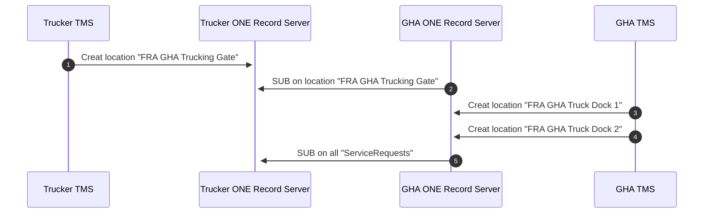
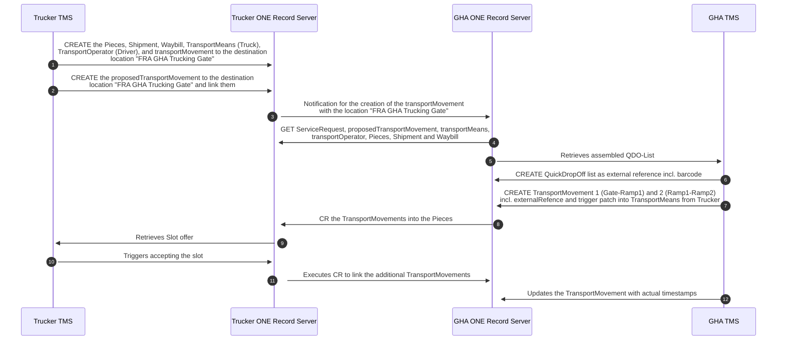
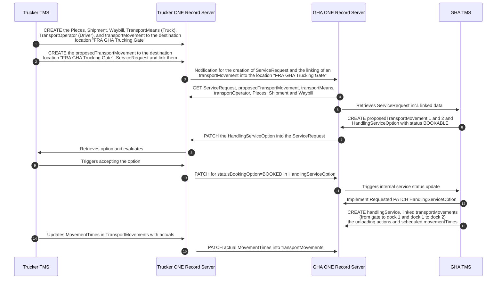

# Good Practice: TruckPreAdvice

[](https://digital-cargo.org)
[](https://creativecommons.org/licenses/by/4.0/)

## Abstract

Today, there´s a lack of transparency for the information on road trucks in the context of cargo transportation. This is often the result of strongly distributed responsibilities and tasks between trucking company, forwarder and air cargo carrier.

The ONE Record standard is supposed to solve this problem by providing a standard to share any kind of data between any stakeholder. This good practice document describes the methodology for providing and consuming TruckPreAdvice information via ONE Record, making this data effortlessly accessible to others. Based on the ONE Record API version 2.0.0 and the ONE Record Data Model version 3.0.0, this document provides guidance on how to implement this use case in an easy-to-use and standardized manner.

## Introduction

In the dynamic world of logistics and cargo, shipment tracking stands as a cornerstone, ensuring visibility, predictability, and trust within the supply chain. 
Yet, as businesses expand and systems diversify, the industry faces a challenge: the myriad of non-standardized tracking systems, each requiring unique integration and understanding. This fragmentation not only complicates operations but also escalates costs and reduces efficiency. The trucking segment for deliveries e.g. from the trucker as agent of the forwarder to the GHA as agent of the carrier is not an exception here.

Initiated and moderated by the International Air Transportation Association (IATA), in 2022, major stakeholders of the supply chain decided to aim for a renewed data sharing infrastructure for the global logistics networks by 2026.
Enter the ONE Record standard, which aims to unify, streamline and improve shipping data across the industry. 
By leveraging the ONE Record standard, stakeholders can draw on a unified data model and API that promotes seamless integration across various platforms and improves collaboration between various organizations. 
This standardization comes with benefits, from reducing the complexity and cost of custom integrations to enhancing transparency and trust.
It lays the foundation for standardization, enabling a consistent data model and API across diverse platforms, thereby streamlining integrations and collaborations.
This uniformity heightens transparency, allowing stakeholders to effortlessly interpret shipment data, fostering trust throughout the supply chain.
Moreover, the standardized approach curtails complexities tied to integration, conserving both time and resources that might otherwise be diverted to bespoke solutions.

### Scope

This good practice details the application of the ONE Record standard specifically in the context of the TruckPreAdvice.

**What this document covers:**

- **Business context**: Assumptions, prerequisites, and the broader business scenario where this good practice is applicable.
- **Technical examples**: Detailed descriptions and examples of the API calls, data model classes, data mappings, and their applications in the context of shipment tracking.

**What this document does not cover:**

- **Compelete implementations**: This good practice includes sample code to support knowledge transfer, it does not provide detailed implementation or out-of-the-box software.
- **Comparison with other standards**: This good practice describes the implementation with the ONE Record Standard. A comparison with other standards in the industry is not covered.
- **Vendor-specific implementations**: This document focuses on the standard itself and does not address specific third-party tools or solutions based on the ONE Record standard.
- **Complete technical specifications**: This document focuses solely on the ONE Record aspects pertinent to the TruckPreAdvice and doesn't encompass the entire technical breadth of the standard.
- **Industry-wide statistics**: This document does not provide exhaustive industry data or statistics on the adoption or performance of the ONE Record standard.

As the industry evolves, it is imperative for stakeholders to keep up to date on subsequent versions or changes to the standard.

**Target audience**

This document is intended for anyone interested in this topic.

**Geographical coverage**

This TruckPreAdvice good practice is globally applicable, unhindered by regional or national distinctions. 
With no legal or operational barriers to its adoption, the outlined solution is primed for worldwide deployment. Still local legal requirements, like Data Protection Laws, must be taken into account.
As a result, companies of any size, at any location, can take advantage of the standardized workflows and increased efficiencies created by ONE Record.

### Variants

No relevant variants known.

## Background

### Stakeholders

In this use case, four parties are involved: The trucking company, the forwarder, the GHA and the carrier. As the trucker usually acts as an agent for the forwarder, and the GHA as an agent for the carrier, we will focus on the roles of trucker and GHA in the following documentation.

The terms "trucker" and "trucking company" are synonym here, as the information can be provided by the trucking company (e.g. directy from the TMS, ), or by the trucker (e.g. an app using ONE Record for exchanging data). This process is very general and can cover export e.g. acceptance at GHA, import pickups at GHA, incoming Road Feed Service, Forwarder´s pick up at Shipper. 

### Business Process (pragmatic approach)

To examplify the use case, the following setting was assumed:

A Trucker/Trucking Company wants to preAdvice a truck for export acceptance at the GHA. In return, the trucker expects to get a ramp assignment and a QR code for each drop off for accelerated identification.

The following business data objects are shared by the trucker:

General Details

- Quick Drop-Off Airport
- Type of vehicle
- Plate
- Company name
- STA and/or ETA
- Piece(s) loaded

Driver details

- First name
- Last name
- Birth date
- Mobile Phone number
- Email address
- Type of ID
- ID Number
- Place of ID Issueing

Remarks: The Quick Drop-Off Airport could be removed as the drop off station is clear by the origin on the AWB.

In return, the GHA will provide

- A sequence of dock assignments
- QDO-Code (Cleartext and Barcode)
- QDO Groups with each
  - Dock (Name and Geolocation (optional))
  - Pieces to be droped of there
  - Time slot (optional)


### ONE Record Standard

The implementation of the TruckPreAdvice as described in this good practice is based entirely on the [ONE Record standard](https://github.com/IATA-Cargo/ONE-Record).

This good practice incorporates data classes of the [ONE Record cargo ontology v3.0.0](https://onerecord.iata.org/ns/cargo)
and the [ONE Record core code lists ontology v0.0.3](https://onerecord.iata.org/ns/coreCodeLists).

Furthermore, it utilises the [ONE Record API specificaiton v2.0.0](https://iata-cargo.github.io/ONE-Record/).

### Related Good Practices

This Good practice is closely related to the [ShipmentTracking](https://github.com/digital-cargo/good-practice-shipment-tracking) and the [shipment record](https://github.com/digital-cargo/good-practice-shipment-record).

### Piece-centricity and physics-orientation

Today in air cargo, tracking information is typically provided at the shipment level, but the ONE Record data model follows the principle of piece-centricity as a core design principle.
Another design principle of ONE Record is its aim to reflect the actual physical world, its objects and activities. 
For example, in ONE Record, it is not a legal object or a paper document such as the Air Waybill (AWB) that marks the progress of a shipment and reaches a milestone. 
Instead, it is the actual [Piece](https://onerecord.iata.org/ns/cargo#Piece), the wrapping [Shipment](https://onerecord.iata.org/ns/cargo#Shipment), or a [TransportMovement](https://onerecord.iata.org/ns/cargo#TransportMovement) activity that reaches a milestone in the journey. 
For example, when every piece in a shipment has been loaded and the aircraft departs, we consider the entire shipment as having departed.

### Implementation

The following sequence diagram shows in which sequence data object need to be created to fulfill the process.

As a one-time preparatory, the relevant locations must be created and subscribed on:



### Business Process (pragmatic approach)

A pragmatic approach is that the trucker provides a TransportMovement to the GHA´s trucking gate and the GHA then provides TransportMovements from the trucking gate to one or more trucking docs.



### Business Process (using the Service-concept)

This variant of the business process applies the Service-concept of ONE Record. The TruckPreAdvice process is using a GHA Service called "QuickDropOff". The sequence for this use case is as follows:
- A trucker provides a serviceRequest with the essential information: the truck and driver information plus the shipments.
- The GHA then provides one or more options for the service. Each service option is a dock slot option a different drop-off time. For this example, we assume there´s only one option provided by the GHA.
- If the slot fits and is to be confirmed, the trucker then requests the GHA to change the Status of the bookingOption to BOOKED.
- The GHA then provides the transportMovements for the different docs and the different pieces according to their nature (e.g. PER, COOL, DGR).
- During the execution of this sequence, the "ACTUAL" timestamps are added to the transportMovement.


The specific sequence of actions per TruckPreAdvice then is as follows:

Step 1: Trucker to provide the shipment data and request the QDO-Service at the GHA




## Data Sharing

### Data Model

**Class Diagam**

This good practice incorporates data classes of the [ONE Record cargo ontology](https://onerecord.iata.org/ns/cargo) 
and the [ONE Record core code lists ontology](https://onerecord.iata.org/ns/coreCodeLists).
For clarity, class inheritance and unused data properties are excluded, and only required properties and relationships are visualized in the following.

The following class diagram shows the LogisticsObject data classes used and their relationships in the context of TruckPreAdvice.


### Data Mapping

As there is no standardized solution in place, a mapping with existing standards is not done.

### Implementation Guidelines

This section outlines mandatory and best practice guidelines for the TruckPreAdvice use case in accordance with the ONE Record standard. 
For every data class and property, compliance requires adherence to certain guidelines marked as MUST, while it is RECOMMENDED to follow others for best practices. 
Additionally, to facilitate comprehension, practical data examples are included to demonstrate the implementation of these guidelines.

**Location**

- As a starting point, there must be a specific location as a destination for truck drives to the carrier for the purpose of cargo drop off / pick up.
- As a convention for this, we would suggest to use a carrier specific wording, e.g. "FRA GHA Trucking Gate". This object can either be created by the carrier, or the trucker. In our example, the trucker creates this object. In the other case, subscriptions and patch requests must be adjusted accordingly.
- It is also possible to use a more general location (e.g. a three letter code "FRA", provided by the Airport Operator). As the subscription on this location will inform all GHAs for all trucks, the access needs to be steered with access control lists. This is not recommended as it might lead to very high data traffic on this one location.
- It is important, that the same location is only created ONCE, not by several parties.

  
```json
{
    "@id": "http://1r.truckerDomain.com/logistics-objects/FRA-FF-WH",
    "@type": "https://onerecord.iata.org/ns/cargo#Location",
    "https://onerecord.iata.org/ns/cargo#locationName": "FRA Freight Forwarder Warehouse",
    "https://onerecord.iata.org/ns/cargo#locationType": "Warehouse"
}
```

**TransportMovement**

- To indicate an incoming truck with shipments to the carrier/GHA, the forwarder has to create a TransportMovement.
- The [arrivalLocation](https://onerecord.iata.org/ns/cargo#arrivalLocation) must link to the carrier´s / GHA´s gate.
- Carrier/GHA have to subscribe on that location, if the location is provided by the trucker, so they get notified whenever a truck is planned for this destination.
- The [transportIdentifier](https://onerecord.iata.org/ns/cargo#transportIdentifier) can be created according to the requirements and conventions of the trucking company and does not have to follow use case specific rules.
- To share the scheduled and/or estimated time of arrival at the carrier / GHA, at least one MovementTimes object must be embedded in the transportMovement.
- The direction for the estimated arrival must be "INBOUND". As this is an essential part of the use case, the use of this data field is mandatory for this use case.
- The movementTimeType must be set according to the nature of the MovementTime, "ESTIMATED" or "SCHEDULED"
- TBD - The movementMilestone ?????
- The movementTimestamp provides the arrival timestamp for this MovementTimeType.
- One or more movementTimes can be embedded, updated movementTimes are simply appended to the previous movementTimes. (CHECK?????)

```json
{
    "@id": "http://1r.gha-domain.com/logistics-objects/TM-GHA-GATE",
    "@type": "https://onerecord.iata.org/ns/cargo#TransportMovement",
    "https://onerecord.iata.org/ns/cargo#departureLocation": [
        {
            "@id": "http://1r.forwarderdomain.com/logistics-objects/FRA-FF-WH"
        }
    ],
    "https://onerecord.iata.org/ns/cargo#arrivalLocation": [
        {
            "@id": "http://1r.gha-domain.com/logistics-objects/FRA-GHA-Trucking-Gate"
        }
    ],
    "https://onerecord.iata.org/ns/cargo#transportMeans": [
        {
            "@id": "http://1r.truckerDomain.com/logistics-objects/truck-DF-DD345"
        }
    ],
    "https://onerecord.iata.org/ns/cargo#loadingActions":
    [  
        {
        "@id": "http://1r.gha-domain.com/logistics-objects/Loading-Tour22_24-01-05"
        }
    ]
}
```

**transportMeans**

- The transportMeans is directly linked into the TransportMovement as described above.
- For this use case, the transportMeans contain the information on the physical truck and the trucking company.
- The type of vehicle is defined in the vehicleType data field.
- The plate is shared via the vehicleRegistration.
- The trucking company is shared via the transportOrganization.
- The TransportOperator is the person driving the truck and is linked into this object.

```json
{
    "@id": "http://1r.truckerDomain.com/logistics-objects/truck-DF-DD345",
    "@type": "https://onerecord.iata.org/ns/cargo#TransportMeans",
    "https://onerecord.iata.org/ns/cargo#vehicleType": "Truck",
    "https://onerecord.iata.org/ns/cargo#vehicleRegistration": "DF-DD345",
    "https://onerecord.iata.org/ns/cargo#operatedTransportMovement":
    [  
        {
            "@id": "http://1r.gha-domain.com/logistics-objects/FRAWH-GHA-GATE",
            "@id": "http://1r.gha-domain.com/logistics-objects/GATE-Dock1",
            "@id": "http://1r.gha-domain.com/logistics-objects/Dock1-Dock2"
        }
    ]
}
```

**person**

- The Person contains information on the driver.
- First and last name are mandatory for this use case.
- The field "document" is of type externalReference contains links to the ID document of the driver.
- The date of birth should be shared as well as a mobile phone number and emailaddress in the embedded contactDetails.

```json
{
    "@id": "http://1r.truckerDomain.com/logistics-objects/Driver4",
    "@type": "https://onerecord.iata.org/ns/cargo#TransportMeans",
    "https://onerecord.iata.org/ns/cargo#firstName": "Daniel",
	"https://onerecord.iata.org/ns/cargo#lastName": "Mustermann"
    ,
    "https://onerecord.iata.org/ns/cargo#loadingActions":
    [  
        {
        "@id": "http://1r.truckerDomain.com/logistics-objects/truck-DF-DD345"
        }
    ]
}
```

**externalReference**

- The externalReference contains the id information of the driver.
- The Type of ID is shared in the documentType. This can be e.g. "Driver Licence", "Passport" or "ID-Card"
- The ID Number is to be shared in the documentIdentifier
- TBC - Place of ID issueing is to be shared in the createdAtLocation (LINK??)

```json
{
    "@id": "http://1r.gha-domain.com/logistics-objects/QDO-1",
    "@type": "https://onerecord.iata.org/ns/cargo#ExternalReference",
     "https://onerecord.iata.org/ns/cargo#documentLink": "https://owncloud.fraunhofer.de/index.php/s/BQ6rmqromCWq39n",
     "https://onerecord.iata.org/ns/cargo#documentType": "QuickDropOffListe",
     "https://onerecord.iata.org/ns/cargo#documentIdentifier": "QDO-1"
}
```

**Loading**

- to link Pieces and TransportMovement, a loading action must be created. TransportMovement and LoadingAction are linked via "onTransportMeans" in the Loading and "LoadingActions" in the TransportMovement.
- For the delivery process, it is recommended to use the loading object for the previous loading of the truck, indicating the loadingType "LOADING"; Carrier / GHA then share the unloading of the truck in a new LoadingAction.
- For a pickup, it is recommended to also use the loadingType "LOADING" and link the pieces to be loaded, but add an embedded actionTimeType "PLANNED" and an  actionStartTime with the estimated pickup-time.
- TBC - Leeres TransportMovement hin für QPU, volles TM zurück, Abholschein.
- This can be a skeleton, or provide information beyond linking a TransportMovmenet with the Pieces that can be shared.
- As a minimum requirement, it must link the TransportMovement in the "servedActivity" and the loaded pieces in the "loadedPieces" data field.

```json
  {
    "@id": "http://1r.gha-domain.com/logistics-objects/QDO-Dock1",
    "@type": "https://onerecord.iata.org/ns/cargo#Loading",
    "https://onerecord.iata.org/ns/cargo#loadedPieces":[  
        {
            "@id": "http://1r.forwarder.com/logistics-objects/AppleBox1"
        }
    ],
     "https://onerecord.iata.org/ns/cargo#servedActivity":[  
        {
            "@id": "http://1r.gha-domain.com/logistics-objects/GATE-Dock1"
        }
    ],
    "https://onerecord.iata.org/ns/cargo#loadingType": "UNLOADING",
	"https://onerecord.iata.org/ns/cargo#performedAt":[  
      	{
            "@id": "http://1r.gha-domain.com/logistics-objects/FRA-GHA-Dock1"
        }
    ],
	"https://onerecord.iata.org/ns/cargo#actionTimeType": "ACTUAL",
	"https://onerecord.iata.org/ns/cargo#actionStartTime": "2024-06-05T15:57:00",
	"https://onerecord.iata.org/ns/cargo#actionEndTime": "2024-06-05T15:59:00"
}
```

**Piece**, **Shipment**, **Waybill**

Generally, there are no specific requirements fot the use of the Logistics Objects of type Piece, Shipment and Waybill by the truck preAdvice use case.

- As ONE Record is piece-centric, most information is directly linked to pieces instead of shipment or waybill, e.g. Loading actions.
- The purpose of the Waybill-Object(s) here is to share the AWB Number(s) of the shipments on the truck. It can be correlated via the LOs shipment and piece.
- Shipment describes the physical side of all pieces under one contract. It doesn´t contain any specific information here.


## Data Sharing

In terms of data exchange, there are no specific requirements for this use case going beyong what e.g. sharing the shipment record requires.

### Required API implementation

The publisher's ONE Record API MUST implement the

- POST, GET & PATCH LogisticsObject endpoint
- Subscribe endpoint

The subscriber's MUST implement a `/notifications` endpoint to receive Notifications.

## Required functions
!!! TO BE UPDATED
The following technical features are required on the data provider side:

- Implemented basic requests: GET, POST
- Generating and managing links for linked data
- Support publish and subscribe

On the data consumer side, even less functions are required for pure data consumption from the open tracking API:

- Making basic GET request
- Retrieving data from linked data sources

single ONE Record server / multiple ONE Record clients

> For each use case what is required: server, client, endpoints

## Glossary

see [digita-cargo/glossary](https://github.com/digital-cargo/glossary)

Business terms:

- "Dock": a dock in this context is the physical location, where a truck is unloaded. Often, the term "ramp" is used. We intentionally used "dock", to aviod confusion with the ramp on the apron.

## References

- [ONE Record Good Practice on Shipment Tracking](https://github.com/digital-cargo/good-practice-shipment-tracking/)

## Acknowledgements

The initial version of this document is the outcome of the Digital Testbed Air Cargo (DTAC), a reasearch framework funded by the German Federal Ministry for Digital and Transport, and the involved partners in this use case (Lufthansa Cargo, CHI Germany, Fraunhofer IML). 

Special thanks to [Niclas Scheiber](https://github.com/NiclasScheiber), Frankfurt University of Applied Sciences for preparing version 3.0.0 of the 
ONE Record core ontology in coordination with the IATA ONE Record data model focus group.

## Community

### Contribute

See [CONTRIBUTING](CONTRIBUTING.md) for more details on how to contribute on this good practice.

### Issues

Issues related to this good practice are tracked on GitHub

- [View open issues](https://github.com/digital-cargo/good-practice-shipment-tracking/issues)
- [Create a new issue](https://github.com/digital-cargo/good-practice-shipment-tracking/issues/new)

### Maintainers

> Each good practice MUST have at least one maintainer who is responsible for ongoing development and quality assurance. 
> Every maintainer MUST have commit access to the good practice repository.

- [Philipp Billion](https://github.com/DrPhilippBillion), Lufthansa Cargo

_(sorted alphabetically)_

### Contributors

> Every good practice is the result of the work of the community, and therefore the contribution of each individual should be recognized and appreciated. 
> Below is a list of all the people who have actively contributed to this good practice.

- [Oliver Ditz](https://github.com/oditz), Fraunhofer IML
- [Oliver Meschkov](https://github.com/Meschkov), CHI
- [Daniel A. Döppner](https://github.com/ddoeppner), Lufthansa Cargo
- [Ingo Zeschky](https://github.com/ChrisKranich), Lufthansa Cargo
- [Philipp Billion](https://github.com/DrPhilippBillion), Lufthansa Cargo

_(sorted alphabetically)_
